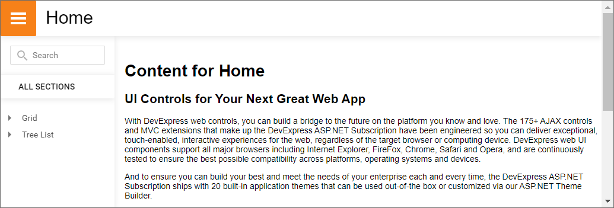

<!-- default badges list -->

<!-- default badges end -->
# ASP.NET Web Forms Controls - How to implement sidebar navigation shown in DevExpress demos
<!-- run online -->
**[[Run Online]](https://codecentral.devexpress.com/t598380/)**
<!-- run online end -->
This example demonstrates how to implement sidebar navigation as in [DevExpress ASP.NET Web Forms demos](https://demos.devexpress.com/ASP/).

In the example, each page has the following structure:

* **Header**  
Displays the page header and a [button](https://docs.devexpress.com/AspNet/11620/components/data-editors/button) that expands or collapses the sidebar element.

* **Sidebar**  
Displays [ASPxTreeView](https://docs.devexpress.com/AspNet/8558/components/site-navigation-and-layout/treeview) and [ASPxNavBar](https://docs.devexpress.com/AspNet/8285/components/site-navigation-and-layout/navigation-bar). The Tree View control shows the site structure and allows users to navigate between pages. The Navigation Bar allows users to search for a particular page.

* **Main Content**  
The content placed in the [main](https://www.w3schools.com/tags/tag_main.asp) element.

## Files to Review

* [Default.aspx](./CS/AdaptiveSlideNavigation/Default.aspx)
* [Default.aspx.cs](./CS/AdaptiveSlideNavigation/Default.aspx.cs) (VB: [Default.aspx.vb](./VB/AdaptiveSlideNavigation/Default.aspx.vb))
* [Navigation.ascx](./CS/AdaptiveSlideNavigation/UserControls/Navigation.ascx) 
* [Navigation.ascx.cs](./CS/AdaptiveSlideNavigation/UserControls/Navigation.ascx.cs) (VB: [Navigation.ascx.vb](./VB/AdaptiveSlideNavigation/UserControls/Navigation.ascx.vb))
* [Search.ascx](./CS/AdaptiveSlideNavigation/UserControls/Search.ascx)
* [Search.ascx.cs](./CS/AdaptiveSlideNavigation/UserControls/Search.ascx.cs) (VB: [Search.ascx.vb](./VB/AdaptiveSlideNavigation/UserControls/Search.ascx.vb))
* [Site.js](./CS/AdaptiveSlideNavigation/Content/Site.js)
